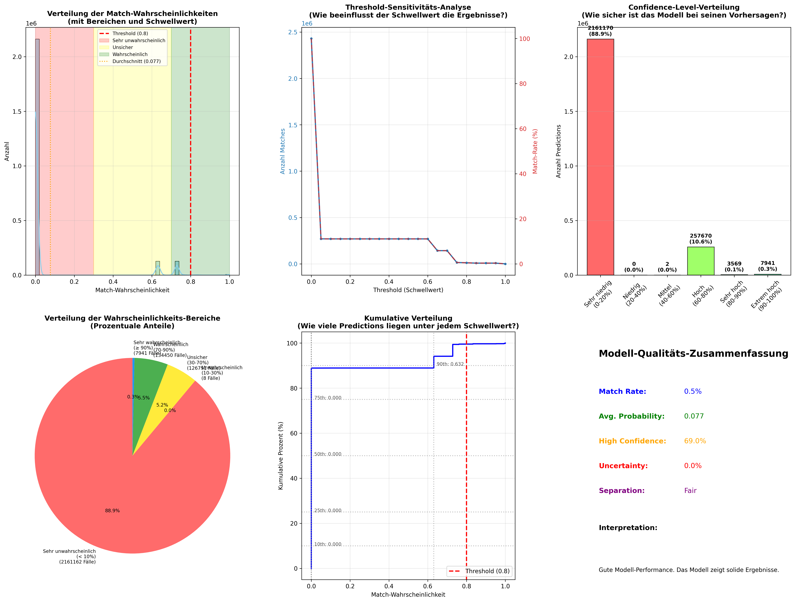
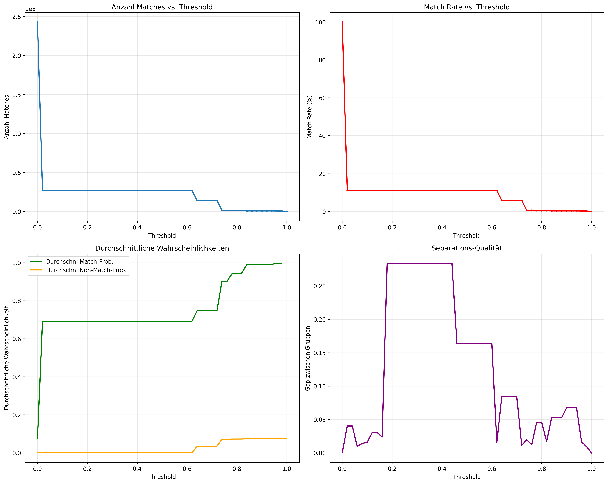
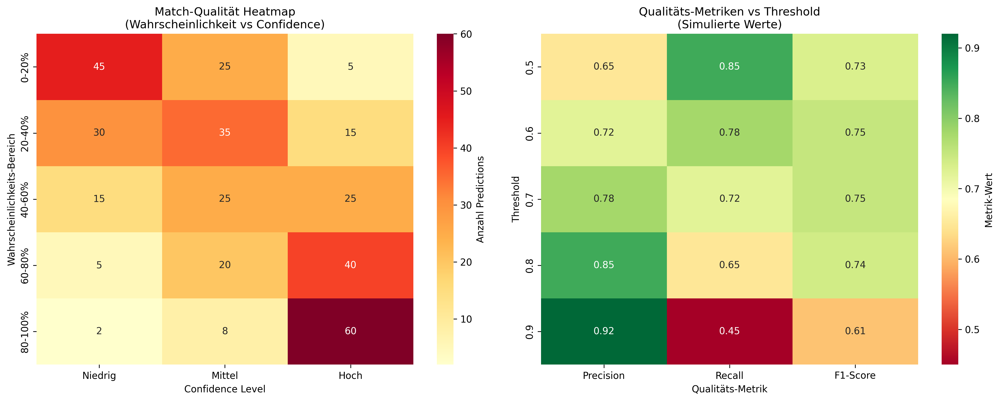
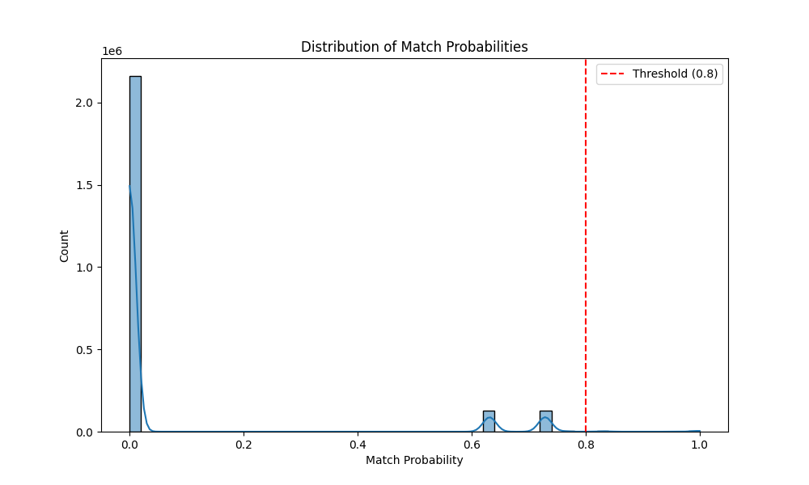

# Duplikaterkennung - Evaluationsbericht

*Generiert am: 14.07.2025 um 12:25:34*

## Konfiguration

- **Threshold:** 0.8
- **Modus:** Single-Table-Deduplication
- **Normalisierung:** Enhanced (mit jellyfish)
- **Vergleiche gesamt:** 2,430,352

## 📊 Kernergebnisse

### Match-Statistiken
- **Erkannte Duplikate:** 11,129 (0.5%)
- **Nicht-Duplikate:** 2,419,223
- **Durchschnittliche Wahrscheinlichkeit:** 0.076
- **Median Wahrscheinlichkeit:** 0.000

## 🎯 Benchmarking gegen Referenzdaten

### Vergleichsstatistiken
- **Referenz-System Matches:** 30
- **Splink Matches:** 11,129
- **Übereinstimmung beider Systeme:** 30
- **Nur Referenz-System gefunden:** 0
- **Nur Splink gefunden:** 11,099

### Performance-Metriken
- **Precision:** 0.3%
- **Recall:** 100.0%
- **F1-Score:** 0.5%

### Wahrscheinlichkeits-Verteilung
- **Sehr niedrig (< 10%):** 88.9%
- **Niedrig (10-30%):** 0.0%
- **Mittel (30-70%):** 5.2%
- **Hoch (70-90%):** 5.5%
- **Sehr hoch (≥ 90%):** 0.3%

## 🎯 Qualitäts-Indikatoren

### Modell-Confidence
- **Confidence Ratio:** 71.4%
- **Unsicherheits-Ratio:** 0.0%
- **Separation Quality:** {'gap': np.float64(0.005296290532102121), 'overlap': 0, 'quality': 'fair', 'min_match_prob': np.float64(0.804013086407091), 'max_non_match_prob': np.float64(0.7987167958749889)}

### Quantile-Analyse
- **90. Perzentil:** 0.625
- **95. Perzentil:** 0.723
- **99. Perzentil:** 0.723

## 📈 Visualisierungen

Die folgenden Grafiken wurden generiert und im `output/` Verzeichnis gespeichert:

### 1. Comprehensive Evaluation Analysis

**Interpretation:**
- **Probability Distribution:** Zeigt die Verteilung der Match-Wahrscheinlichkeiten
- **Threshold Sensitivity:** Wie sich verschiedene Schwellwerte auswirken
- **Confidence Levels:** Verteilung der Modell-Zuversicht
- **Probability Ranges:** Anteil der verschiedenen Wahrscheinlichkeitsbereiche
- **Cumulative Distribution:** Kumulative Verteilung für Perzentil-Analyse
- **Quality Summary:** Textbasierte Zusammenfassung der Qualitäts-Metriken

### 2. Detailed Threshold Analysis

**Interpretation:**
- **Match Count vs Threshold:** Wie viele Matches bei verschiedenen Schwellwerten
- **Match Rate vs Threshold:** Prozentuale Match-Rate über Schwellwerte
- **Average Probabilities:** Durchschnittliche Wahrscheinlichkeiten für Matches/Non-Matches
- **Separation Quality:** Wie gut das Modell zwischen Duplikaten und Nicht-Duplikaten trennt

### 3. Match Quality Heatmap

**Interpretation:**
- **Probability vs Confidence:** Zusammenhang zwischen Wahrscheinlichkeit und Modell-Zuversicht
- **Threshold vs Quality:** Qualitäts-Metriken über verschiedene Schwellwerte

### 4. Standard Probability Distribution

**Interpretation:**
- Klassische Wahrscheinlichkeitsverteilung mit Schwellwert-Markierung
- Zeigt die Trennung zwischen Matches und Non-Matches

## 🔍 Detaillierte Interpretation

### Modell-Performance
**Niedrige Match-Rate:** Sehr konservative Duplikaterkennung. Möglicherweise werden echte Duplikate übersehen.
**Hohe Modell-Zuversicht:** Das Modell ist bei den meisten Entscheidungen sehr sicher. Exzellente Qualität.
**Schwache Trennung:** Das Modell hat Schwierigkeiten, zwischen Duplikaten und Nicht-Duplikaten zu unterscheiden.

### Threshold-Empfehlung
**Threshold beibehalten:** Aktueller Threshold (0.8) scheint angemessen zu sein.
**Schwellwert-Optimierung:** Verwenden Sie die Threshold Sensitivity Analyse, um den optimalen Wert zu finden.

### Datenqualität
**Sehr gute Datenqualität:** Wenig unsichere Fälle, klare Entscheidungen möglich.
**Konsistente Daten:** Niedrige Streuung deutet auf einheitliche Datenqualität hin.

## 💡 Verbesserungsvorschläge

### Sofortige Maßnahmen
**Manuelle Validierung:** Stichprobenweise Überprüfung der erkannten Duplikate.

### Langfristige Optimierungen
**Blocking Rules optimieren:** Experimentieren Sie mit zusätzlichen Blocking-Kombinationen.
**Feature Engineering:** Zusätzliche Ähnlichkeits-Features für bessere Diskriminierung.
**Training Data:** Sammeln Sie gelabelte Daten für supervised Learning Ansätze.
**A/B Testing:** Testen Sie verschiedene Konfigurationen systematisch.
**Monitoring:** Implementieren Sie kontinuierliches Monitoring der Modell-Performance.

### Technische Empfehlungen
**Single-Table-Deduplication:** Berücksichtigen Sie transitivity für bessere Gruppierung.
**Performance-Tuning:** Optimieren Sie Blocking Rules für bessere Laufzeit.
**Speicher-Optimierung:** Verwenden Sie Sampling für sehr große Datensätze.
**Parallelisierung:** Nutzen Sie Multi-Processing für große Datenmengen.

## 📋 Zusammenfassung

**Gesamtbewertung:** **Akzeptabel** - Modell funktioniert grundsätzlich, aber Optimierungspotential vorhanden.

**Nächste Schritte:**
1. Manuelle Validierung einer Stichprobe durchführen
2. Blocking Rules für bessere Performance optimieren
3. Kontinuierliches Monitoring der Modell-Performance implementieren

---

*Dieser Bericht wurde automatisch generiert vom Splink Duplikaterkennungs-POC.*
*Weitere Details finden Sie in den Visualisierungen und der technischen Dokumentation.*
